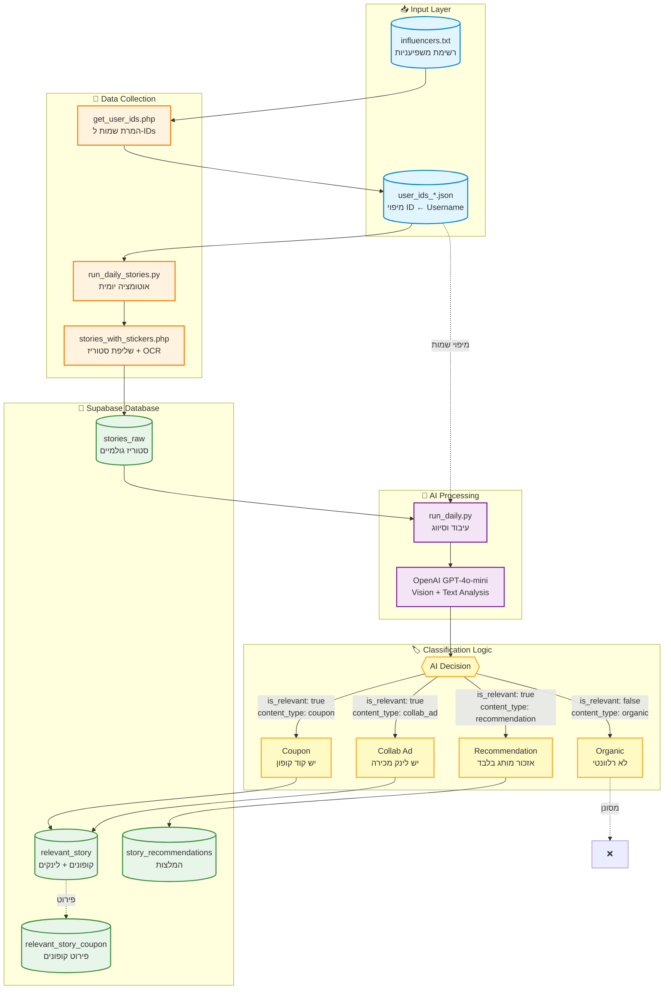

# Instagram Stories Analysis - Architecture

## System Overview

This document describes the architecture of the Instagram Stories analysis system.

## Architecture Diagram

## Components Description

### Input Layer
- **influencers.txt**: List of influencer usernames to track
- **user_ids_*.json**: Mapping between Instagram user IDs and usernames

### Data Collection
- **get_user_ids.php**: Converts usernames to Instagram user IDs
- **stories_with_stickers.php**: Fetches stories and performs OCR
- **run_daily_stories.py**: Daily automation script

### AI Processing
- **run_daily.py**: Main processing and classification script
- **OpenAI GPT-4o-mini**: Vision + text analysis for content classification

### Database Tables
- **stories_raw**: Raw story data from Instagram
- **relevant_story**: Stories with coupons or affiliate links
- **story_recommendations**: Stories with brand mentions (no direct link/coupon)
- **relevant_story_coupon**: Detailed coupon information

### Classification Types
1. **Coupon**: Has a coupon code → saved to `relevant_story`
2. **Collab Ad**: Has affiliate/purchase link → saved to `relevant_story`
3. **Recommendation**: Brand mention only → saved to `story_recommendations`
4. **Organic**: No commercial intent → filtered out
