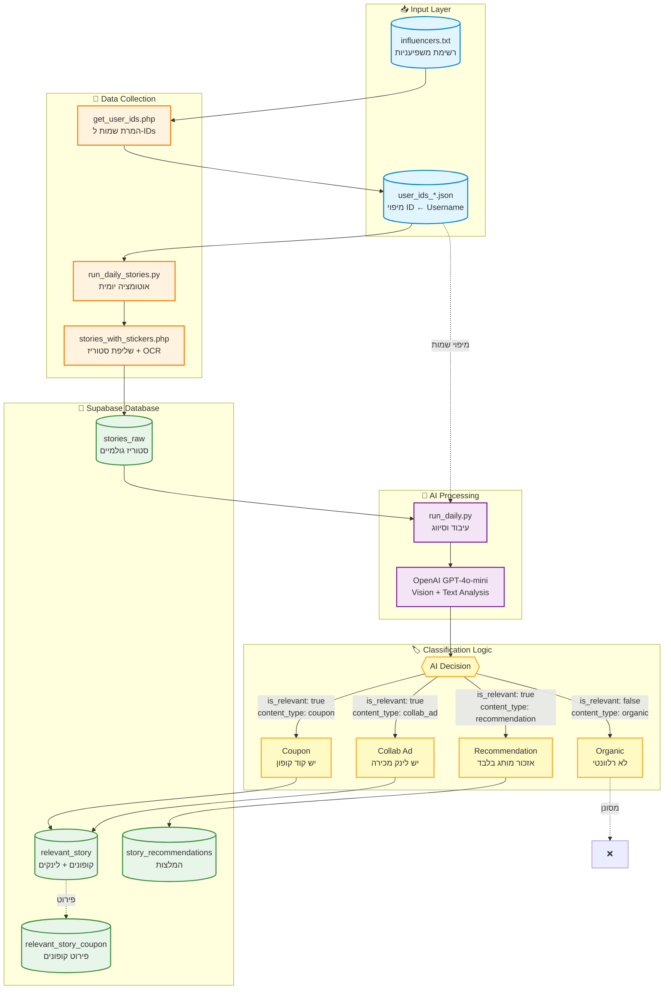
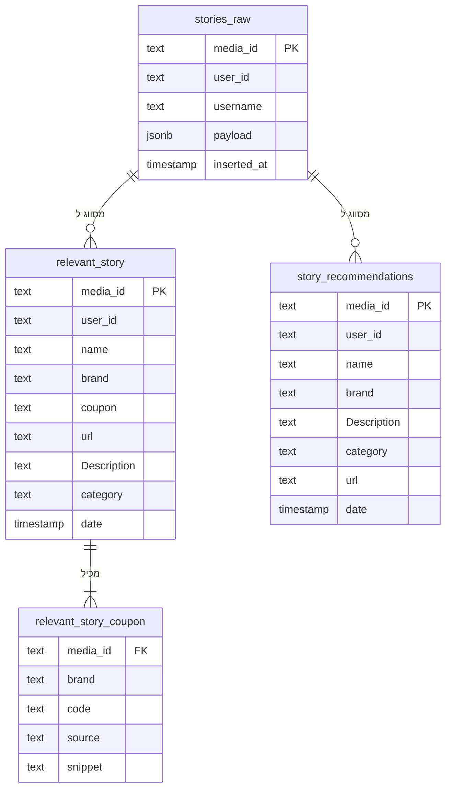

# 📸 Instagram Stories Analysis System

<div align="center">


**מערכת מתקדמת לניתוח סטוריז של אינסטגרם עם זיהוי חכם של קופונים, לינקים והמלצות**

[תכונות](#-תכונות-עיקריות) • [התקנה](#-התקנה-מהירה) • [שימוש](#-שימוש) • [ארכיטקטורה](#-ארכיטקטורה)

</div>

---

## 🎯 מה המערכת עושה?

המערכת מבצעת ניתוח אוטומטי של סטוריז מאינסטגרם ומסווגת אותן לפי סוג תוכן מסחרי:

| סוג תוכן | תיאור | יעד שמירה |
|---------|-------|-----------|
| 🎟️ **Coupon** | קוד קופון להנחה | `relevant_story` |
| 🔗 **Collab Ad** | לינק שיתוף/אפיליאייט | `relevant_story` |
| 💡 **Recommendation** | המלצה על מותג (ללא לינק) | `story_recommendations` |
| 📱 **Organic** | תוכן אורגני | מסונן החוצה |

## ✨ תכונות עיקריות

- 🤖 **ניתוח AI מתקדם** - שימוש ב-GPT-4o-mini לזיהוי תוכן מסחרי
- 🔍 **OCR חכם** - זיהוי טקסט בתמונות ווידאו (Tesseract + FFmpeg)
- 📊 **סיווג אוטומטי** - הפרדה בין קופונים, לינקים והמלצות
- 🗄️ **אחסון מובנה** - שמירה ב-Supabase עם טבלאות ייעודיות
- 👤 **מיפוי משתמשים** - המרה אוטומטית של IDs לשמות משתמש
- ⚡ **ביצועים מהירים** - עיבוד טקסט בלבד (ללא הורדת תמונות)
- 🔄 **אוטומציה יומית** - הרצה מתוזמנת עם `run_daily_stories.py`

## 🏗️ ארכיטקטורה



## 🚀 התקנה מהירה

### דרישות מקדימות

| תוכנה | גרסה מינימלית | הורדה |
|-------|---------------|-------|
| PHP | 7.2+ | [php.net](https://www.php.net/) |
| Python | 3.13+ | [python.org](https://www.python.org/) |
| Composer | Latest | [getcomposer.org](https://getcomposer.org/) |
| uv | Latest | [astral.sh/uv](https://astral.sh/uv) |

### התקנת תלויות

```powershell
# התקנת תלויות PHP
composer install

# התקנת תלויות Python
uv sync
```

### הגדרת משתני סביבה

צרי קובץ `.env` בשורש הפרויקט:

```env
# Instagram Credentials
IG_SESSIONID=your_session_id_here
IG_DS_USER_ID=your_user_id_here
IG_CSRF=your_csrf_token_here

# Supabase Configuration
SUPABASE_URL=https://your-project.supabase.co
SUPABASE_SERVICE_KEY=your_service_role_key

# OpenAI API
OPENAI_API_KEY=sk-your-openai-api-key

# Optional: OCR & Video Processing
TESSERACT_PATH=C:\Program Files\Tesseract-OCR\tesseract.exe
OCR_LANGS=heb+eng
FFMPEG_PATH=C:\ffmpeg\bin\ffmpeg.exe
PHP_PATH=C:\php\php.exe
```

> [!TIP]
> לקבלת ה-Session ID, התחברי לאינסטגרם בדפדפן ובדקי את ה-Cookies (DevTools → Application → Cookies)

## 📖 שימוש

### 1️⃣ הכנת רשימת משפיעניות

ערכי קובץ `influencers.txt`:

```text
sivanazriel123
danagrotsky
username3
```

### 2️⃣ קבלת User IDs

```powershell
php get_user_ids.php --file influencers.txt
```

**פלט:**
- טבלה מעוצבת בטרמינל
- קובץ JSON: `user_ids_2025-11-30_120000.json`

### 3️⃣ משיכת סטוריז (ידני)

```powershell
# סטורי של משפיענית אחת
php stories_with_stickers.php USER_ID

# מספר משפיעניות
php batch_stories.php --file user_ids.txt
```

### 4️⃣ הרצה אוטומטית יומית

```powershell
# הרצה אוטומטית של כל המשפיעניות
python run_daily_stories.py

# עם פרמטרים מותאמים
python run_daily_stories.py --min-delay 30 --max-delay 120 --dry-run
```

### 5️⃣ עיבוד וסיווג עם AI

```powershell
python run_daily.py
```

**מה הסקריפט עושה:**
1. ✅ טוען מיפוי שמות משתמש מ-JSON
2. 📥 שולף סטוריז מ-`stories_raw`
3. 🤖 מנתח עם OpenAI GPT-4o-mini
4. 🏷️ מסווג לפי סוג תוכן
5. 💾 שומר בטבלה המתאימה

## 📁 מבנה הפרויקט

```
instagram-php-scraper-master/
├── 📄 PHP Scripts
│   ├── stories_with_stickers.php    # משיכת סטוריז + OCR
│   ├── get_user_ids.php              # המרת usernames ל-IDs
│   └── batch_stories.php             # עיבוד מרובה
│
├── 🐍 Python Scripts
│   ├── run_daily.py                  # עיבוד AI וסיווג
│   └── run_daily_stories.py          # אוטומציה יומית
│
├── ⚙️ Configuration
│   ├── .env                          # משתני סביבה
│   ├── composer.json                 # תלויות PHP
│   └── pyproject.toml                # תלויות Python
│
├── 📊 Data Files
│   ├── influencers.txt               # רשימת משפיעניות
│   └── user_ids_*.json               # מיפוי IDs
│
├── 🗄️ Database
│   └── create_story_recommendations.sql
│
└── 📚 Documentation
    ├── README.md                     # המסמך הזה
    ├── ARCHITECTURE.md               # תיעוד ארכיטקטורה
    ├── README_USER_IDS.md            # מדריך IDs
    └── README_DAILY_STORIES.md       # מדריך אוטומציה
```

## 🗄️ מבנה מסד הנתונים

### טבלאות Supabase



### יצירת טבלת ההמלצות

```sql
create table if not exists story_recommendations (
  media_id text not null primary key,
  user_id text,
  name text,
  brand text,
  date timestamp with time zone,
  "Description" text,
  category text,
  url text,
  created_at timestamp with time zone default timezone('utc'::text, now()) not null
);
```

## 🔧 תכונות מתקדמות

### OCR (זיהוי טקסט בתמונות)

1. הורידי [Tesseract OCR](https://github.com/UB-Mannheim/tesseract/wiki)
2. הגדירי ב-`.env`:
   ```env
   TESSERACT_PATH=C:\Program Files\Tesseract-OCR\tesseract.exe
   OCR_LANGS=heb+eng
   ```

### עיבוד וידאו

1. הורידי [FFmpeg](https://ffmpeg.org/download.html)
2. הגדירי ב-`.env`:
   ```env
   FFMPEG_PATH=C:\ffmpeg\bin\ffmpeg.exe
   ```

### אופטימיזציה לביצועים

המערכת מותאמת לביצועים גבוהים:
- ✅ **ניתוח טקסט בלבד** - ללא הורדת תמונות
- ✅ **OCR מראש** - PHP מבצע OCR לפני Python
- ✅ **מטמון שמות** - מיפוי מקומי של IDs
- ✅ **Batch Processing** - עיבוד מרובה ביעילות

**ביצועים משוערים:**
- ~30-50 שניות ל-10 סטוריז
- ~5-8 דקות ל-600 סטוריז
- חיסכון של ~70% בעלויות API

## 🆘 פתרון בעיות

<details>
<summary><b>שגיאה: "Missing env: IG_CSRF / IG_SESSIONID"</b></summary>

**פתרון:**
1. ודאי שקובץ `.env` קיים בשורש הפרויקט
2. בדקי שכל המשתנים מוגדרים
3. אל תשתמשי במרכאות סביב הערכים
</details>

<details>
<summary><b>שגיאה: "HTTP 401" או "HTTP 403"</b></summary>

**פתרון:**
Session פג תוקף:
1. התחברי מחדש לאינסטגרם בדפדפן
2. עדכני את ה-Cookies ב-`.env`
3. הריצי שוב
</details>

<details>
<summary><b>שגיאה: "NameError: name 'MAX_ROWS' is not defined"</b></summary>

**פתרון:**
הקבועים נמחקו בטעות - הם כבר תוקנו בגרסה האחרונה. עדכני את הקוד.
</details>

<details>
<summary><b>שגיאה: "'messages' must contain the word 'json'"</b></summary>

**פתרון:**
ה-System Prompt חייב להכיל את המילה "JSON" - כבר תוקן בגרסה האחרונה.
</details>

## 📊 דוגמאות פלט

### תיאור קופון
```
קוד SIVAN10 מקנה 10% הנחה באתר KSP על כל מוצרי החשמל
```

### תיאור לינק שיתוף
```
לינק לרכישת שמלת ערב שחורה של מותג ZARA - קולקציה חדשה
```

### תיאור המלצה
```
המלצה על מוצרי טיפוח שיער של מותג PROHAIRPLUS
```

## 🤝 תרומה

רוצים לתרום? מעולה!

1. Fork את הפרויקט
2. צרו branch חדש (`git checkout -b feature/AmazingFeature`)
3. Commit את השינויים (`git commit -m 'Add some AmazingFeature'`)
4. Push ל-branch (`git push origin feature/AmazingFeature`)
5. פתחו Pull Request

## 📄 רישיון

MIT License - ראו קובץ [LICENSE](LICENSE) לפרטים נוספים.

---

<div align="center">

**נבנה עם ❤️ בישראל**

[דווח על באג](https://github.com/your-repo/issues) • [בקש תכונה](https://github.com/your-repo/issues)

</div>
